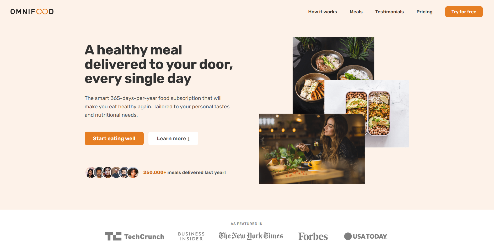
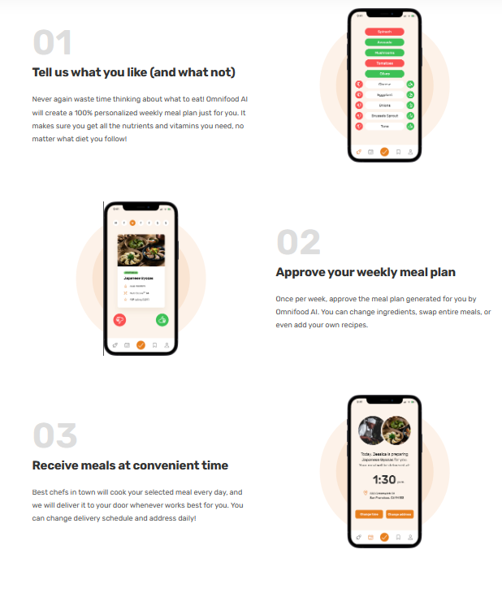
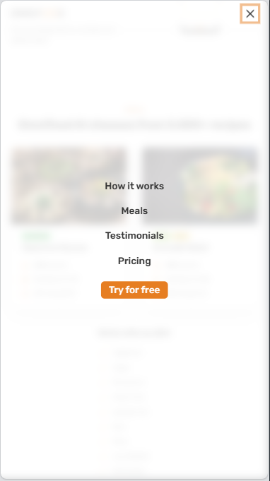

Live project: https://omnifood-dancodecraft.netlify.app/

# Omnifood - Never cook again!

## Table of contents

- [Overview](#overview)
  - [The challenge](#the-challenge)
  - [Links](#links)
- [My process](#my-process)
  - [Built with](#built-with)
- [Author](#author)
  - [Screenshots](#screenshots)

## Overview

Omnifood is a product based on creating meals using AI.

### The challenge

Users should be able to:

- Create a subscription to the product
- Select the desired plan
- Check the hover effects
- Website is optimized for desktop and all sizes of mobile

### Links

- Github URL: [Respository link](https://github.com/DanCodeCraft/Omnifood/)
- Live Site URL: [Add live site URL here](https://omnifood-dancodecraft.netlify.app/)

## My process

- I took a desktop-first approach as the mobile design wasn't provided
- Wrote the HTML section by section
- Stylized the CSS after each section was created
- Adapted as I progressed
- Used a lot of contrast checkers to create a pleasing visual experience
- Used JavaScript for the mobile menu and background effects

### Built with

- Semantic HTML5 markup
- CSS custom properties
- Flexbox
- Grid
- Media queries
- Desktop-first workflow
- JavaScript

## Author

- Website - [LinkedIn](https://www.linkedin.com/in/adannjacinto/)
- Frontend Mentor - [@DanCodeCraft](https://www.frontendmentor.io/profile/DanCodeCraft)
- Twitter - [@DanCodeCraft](https://www.twitter.com/DanCodeCraft)

### Screenshots

